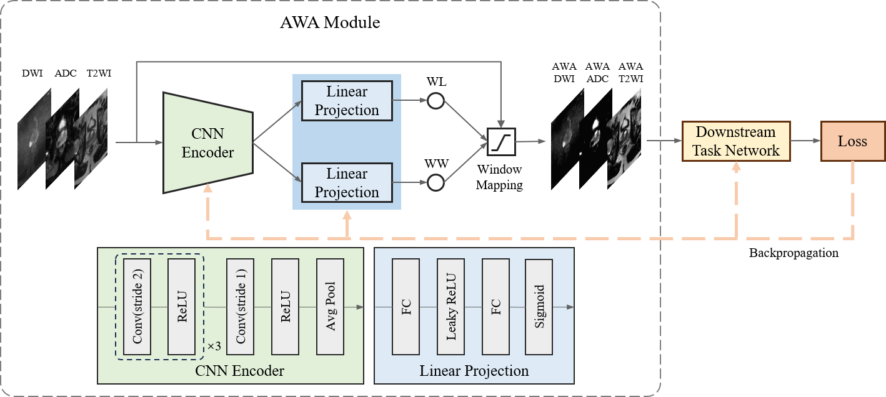

# Adaptive Window Adjustment


# How to use AWA module
Connect the AWA module to the downstream task network:

```python
import torch
from awa_module_2d import AWA_Module  # use for 2D input
# from awa_module_3d import AWA_Module  # use for 3D input

class DownstreamNet(nn.Module):
    def __init__(self, in_channels, out_channels):
        super(DownstreamNet, self).__init__()

        # AWA init
        self.awa = AWA_Module(in_ch=in_channels)

        # Keep the same as the original
        # ......
    
    def forward(self, x):
        x = self.awa(x)  # Input and output dimensions are consistent

        # Keep the same as the original
        # ......
```