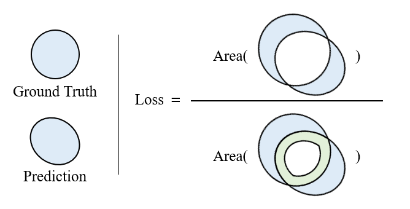

BoundaryDoULoss

The computation of the Boundary DoU Loss is represented as follows:

$L_{DoU}=\frac{G\cup P-G\cap P}{G\cup P-\alpha\cdot G\cap P}$

Where $G$ and $P$ denote the ground truth and prediction, respectively. The parameter $\alpha$ serves to control the balance between focusing on the boundary and internal regions during target segmentation.

For 2D BoundaryDoULoss:

$\alpha=1-2\times\frac{C}{S},\alpha\in[0,1)$

Where $C$ signifies the boundary length of the target, and $S$ signifies its size.

For 3D BoundaryDoULoss:

$\alpha=1-2\times\frac{S}{V},\alpha\in[0,1)$

where $S$ represents the boundary surface area of the target, and $V$ denotes its volume.

# How to use BoundaryDoULoss
```python
from boundary_dou_loss_2d import BoundaryDoULoss  # 2D
# from boundary_dou_loss_3d import BoundaryDoULoss  # 3D

# init
n_classes = 2  # Number of categories
loss_fuction = BoundaryDoULoss(n_classes=n_classes)

loss = loss_fuction(pred, target)  
```

# Reference
@inproceedings{sun2023boundary,
  title={Boundary difference over union loss for medical image segmentation},
  author={Sun, Fan and Luo, Zhiming and Li, Shaozi},
  booktitle={International Conference on Medical Image Computing and Computer-Assisted Intervention},
  pages={292--301},
  year={2023},
  organization={Springer}
}
