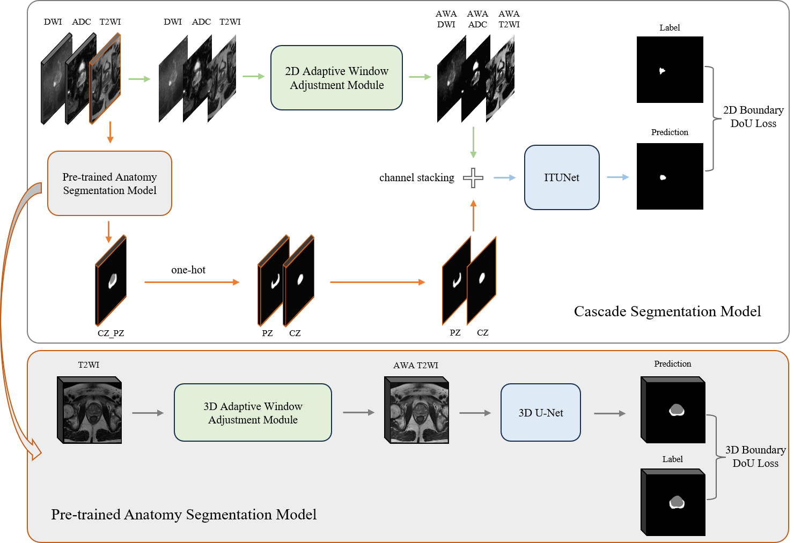
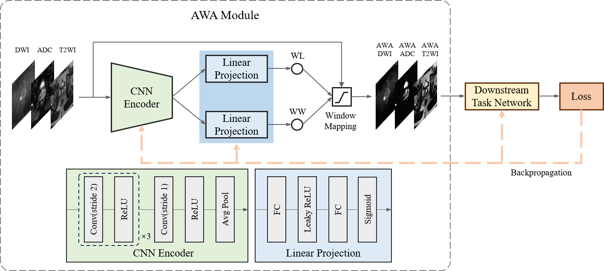

# AWA_BoundaryDoULoss
## Introduction
This repository is an implementation of the paper "Adaptive Window Adjustment with Boundary DoU Loss for Cascade Segmentation of Anatomy and Lesions in Prostate Cancer using bpMRI".

1. Cascade Segmentation


2. Adaptive Window Adjustment Module


3. Boundary DoU Loss


## Contents

- [Adaptive Window Adjustment (AWA)](./AWA/README.md)  
- [BoundaryDoULoss](./BoundaryDoULoss/README.md)  
- [Experiments on the Prostate158+ProstateX dataset](./Prostate158_ProsateX/README.md)
- [Experiments on the PI-CAI dataset](./PI-CAI/README.md)
- [Experiments on the MSD dataset](./MSD/README.md)
- [manuscript data](./manuscript_data/README.md)

# Datasets
- [PI-CAI_image](https://pi-cai.grand-challenge.org/DATA/)
- [PI-CAI_label](https://github.com/DIAGNijmegen/picai_labels)
- [Prostate158_train_data](https://zenodo.org/records/6481141)
- [Prostate158_test_data](https://zenodo.org/records/6592345)
- [ProstateX](https://github.com/rcuocolo/PROSTATEx_masks)
- [Medical Segmentation Decathlon](http://medicaldecathlon.com/)

## Requirements
```
pip install -r requirements.txt
```

## Acknowledgements
- [https://github.com/sunfan-bvb/BoundaryDoULoss](https://github.com/sunfan-bvb/BoundaryDoULoss)
- [https://github.com/MGH-LMIC/windows_optimization](https://github.com/MGH-LMIC/windows_optimization)
- [https://github.com/kbressem/prostate158](https://github.com/kbressem/prostate158)
- [https://github.com/rcuocolo/PROSTATEx_masks](https://github.com/rcuocolo/PROSTATEx_masks)
- [https://github.com/Yukiya-Umimi/ITUNet-for-PICAI-2022-Challenge](https://github.com/Yukiya-Umimi/ITUNet-for-PICAI-2022-Challenge)